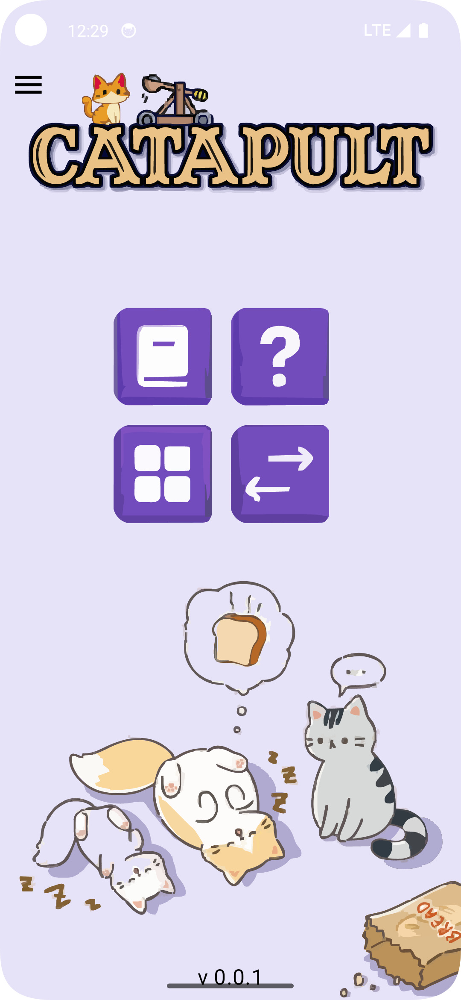
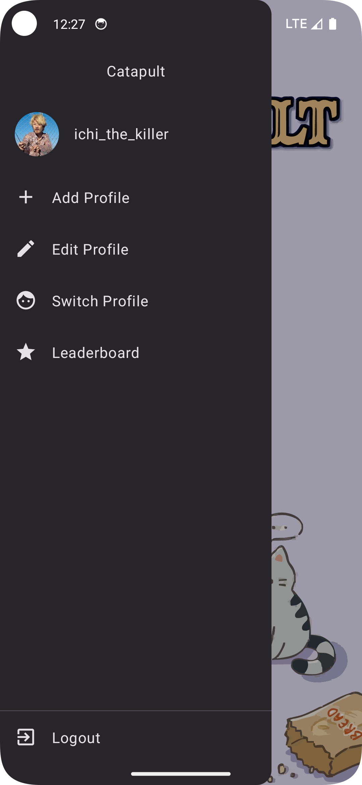
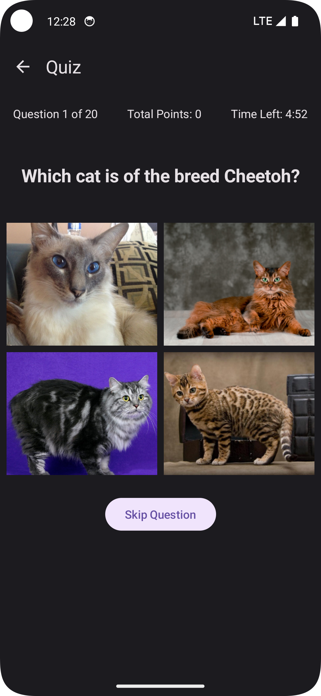
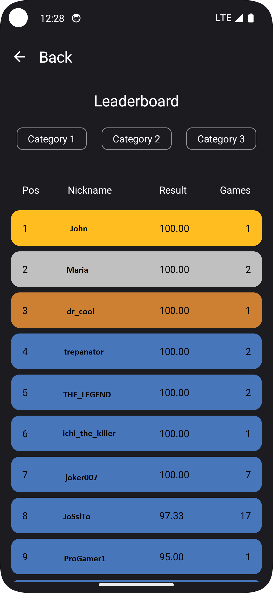

# Catapult

Catapult is an Android application developed in Kotlin as expansion of Catalog app, designed to provide users with detailed information about various cat breeds, alongside an interactive quiz to test their knowledge. The app supports account creation, displays a catalog of cat breeds, quiz, and includes a leaderboard to track top scores.

## Table of Contents

- [Features](#features)
- [Dependencies](#dependencies)
- [Images](#images)

## Features

### Account Creation and Management
- Support for avatar selection.
- Multi-account support with the ability to switch between accounts.
- Logout functionality.
- View and edit account information.
- Display historical quiz results and best scores.

### Cat Breed Catalog
- Browse a searchable list of cat breeds.
- View detailed information about each breed.
- Access a gallery of breed photos with a full-screen photo viewer.

### Cat Knowledge Quiz
- Interactive quiz with 20 random questions.
- Multiple categories and question types.
- Timed quiz sessions with a 5-minute limit.
- Score calculation and leaderboard submission.

### Leaderboard
- View player's ranking and game statistics.

### Visual and UX Features:
- Material Design 3 components.
- Support for dark mode and edge-to-edge design.
- Smooth animations and transitions in the quiz.
- Audio and SFX support.

## Dependencies
### Development
- Jetpack Compose (1.5.1)
- Jetpack Navigation (2.7.7)
- Room (2.6.1)
- Datastore (1.1.1)
- Hilt (2.51)
- Retrofit (2.11.0)
- OkHttp (4.12.0)
- KotlinX Serialization (1.6.3)
- Coil (2.6.0)
### Testing
- Kotest (5.9.0)
- Mockk (1.13.10)
- Kotlinx Coroutines Test (1.8.0)
- AndroidJUnit4 (1.1.5)

## Images

